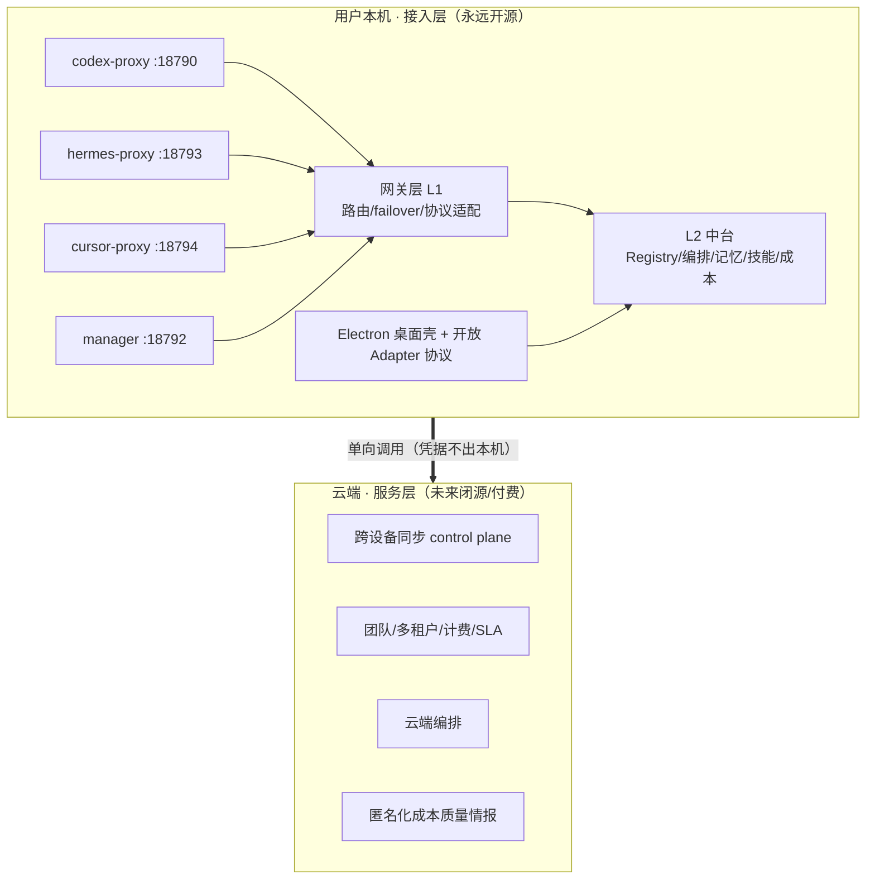

# 开放层 / 增值层边界规划（接入层 / 服务层分层）

> 最后验证：2026-09-22 · 适用 multi-proxy main（HEAD 以 `docs/01-feature-matrix.md` 为准）
> 本文是 `commercialization-decided.md` §3.1「内核开源 + 增值闭源」的**可执行落地版**，不另起炉灶。
> 配套架构：`docs/03-architecture/architecture.md`（四层模型）、`docs/04-business/commercialization-decided.md`（D2 决策）。

---

## 一句话定位

multi-proxy 现在 100% 开源。本文只做一件事：**把代码预先按「接入层（永远开源）/ 服务层（未来可闭源付费）」切好边界**，将来插增值功能时开源层一行不改、不伤社区、不维护两份代码。

边界原则（沿用 D2 §3.1）：免费层 = 本机跑的全部能力；付费层 = 只有放云端才合理的那部分。

---

## 分层草图

```
┌──────────────────────────────────────────────────────────────────────────┐
│                      用户本机（永远开源）· 接入层                           │
│                                                                            │
│  ┌──────────┐  ┌──────────┐  ┌──────────┐  ┌────────────────────────┐    │
│  │codex-proxy│  │hermes-   │  │cursor-   │  │ multi-proxy-manager     │    │
│  │  :18790  │  │proxy     │  │proxy     │  │  :18792 (Web UI + 进程) │    │
│  │          │  │  :18793  │  │  :18794  │  │                         │    │
│  └──────────┘  └──────────┘  └──────────┘  └────────────────────────┘    │
│         │              │              │                    │               │
│  ┌──────┴──────────────┴──────┐  ┌────┴─────────────────────────────┐     │
│  │ 网关层 L1                   │  │ L2 中台（编排中枢）               │     │
│  │  API Gateway / 协议适配     │  │ Registry · 编排 · 插件运行时       │     │
│  │  failover / 复杂度档位路由  │  │ 记忆 · 技能 · 告警 · 成本 · 路由   │     │
│  └────────────────────────────┘  └───────────────────────────────────┘     │
│  ┌──────────────────────────────────────────────────────────────────┐     │
│  │ Electron 桌面壳 + 面板 · Agent Adapter 开放协议（MCP / HTTP / 文件）│     │
│  └──────────────────────────────────────────────────────────────────┘     │
│  红线：API key 明文/密文 · 用户代码 · 提示词 · 会话原文 —— 一律不出本机       │
└──────────────────────────────────────────────────────────────────────────┘
                                   │ 单向调用（本机 → 云端，凭据只在本机）
                                   ▼
┌──────────────────────────────────────────────────────────────────────────┐
│                    云端（未来闭源 / 付费）· 服务层                            │
│                                                                            │
│  • 跨设备配置 / 凭证同步（control plane，天然云上、可自托管可选）             │
│  • 团队共享路由策略 · 多租户 · 统一计费 / 配额 / SLA                         │
│  • 云端编排（跨机调度）                                                     │
│  • 匿名化成本 / 质量情报（跨用户 benchmark，只聚合、不存原文）               │
│  特点：无状态 · 多租户 · 不碰用户明文密钥 → 可闭源、可自托管                  │
└──────────────────────────────────────────────────────────────────────────┘
```

Mermaid 版（GitHub / 支持 Mermaid 的查看器可直接渲染）：



---

## 逐模块归属表

| 模块（真实路径） | 归属 | 理由 |
|---|---|---|
| codex / hermes / cursor / manager 四代理 | 接入层（开源） | 跑在用户机器，拦截转发，碰不到用户 key 之外的东西 |
| 网关层 L1：API Gateway / 协议适配（Responses↔ChatComp）/ 负载均衡 / 路由规则 | 接入层（开源） | M6 智能路由是核心壁垒之一，必须在开源层 |
| L2 中台：Registry / 编排 / 插件运行时 / 拆解 / 记忆 / 技能 / 告警 / 路由引擎 | 接入层（开源） | 全本地、非侵入，开源反而利于生态 |
| `cost.js` / `cost-track.js`（本地成本计算） | 接入层（开源） | 用户自己的 token×单价 + 余额趋势，在本地算 |
| `savings-gateway`（本地模拟省账） | 接入层（开源） | shadow 模拟，不依赖外部 |
| Electron 桌面壳 + 面板 (P5) | 接入层（开源） | 用户侧 UI，开源增强信任 |
| Agent Adapter 开放协议（MCP / HTTP / 文件队列） | 接入层（开源） | 开放接入是卖点，协议必须公开 |
| 本地模型 judge（Qwen3.8-27B/MLX） | 接入层（开源） | 执行器在本地，用户自带 |
| 跨设备配置 / 凭证同步 | 服务层（未来闭源） | 天然云上、多端一致，非本机不可 |
| 团队共享路由策略 / 多租户 | 服务层（未来闭源） | 多人协作状态天然集中 |
| 统一计费 / 配额 / SLA | 服务层（未来闭源） | 跨用户账务，必须中心化 |
| 云端编排（跨机调度） | 服务层（未来闭源） | 调度态在云，执行态仍在用户机 |
| 匿名化成本 / 质量情报（跨用户 benchmark） | 服务层（未来闭源） | 聚合才有价值，单用户无意义 |

---

## 边界红线（绝不能越）

1. 用户 **API key（明文或密文）**、**源代码**、**提示词**、**会话原文** 一律只在本机，服务层接口设计时**协议上就不接收**这些明文。
2. 同步类功能：密钥在客户端加密后再上传，服务端只存密文、无密钥。
3. 情报类功能：只上报聚合指标（如「X 类任务在 Provider A 平均耗时/花费」），**不存任何 prompt / 输出原文**。
4. 开源层代码**不依赖**任何服务层端点才能跑；服务层断网，本机功能 100% 照常。

---

## 分阶段落地建议

| 阶段 | 动作 | 开源层改动 |
|---|---|---|
| 现在（阶段 0） | 全开源。本文只划边界，**不写服务层一行代码**，仅在目录/包层面预留 `services/` 位置 | 0 |
| 阶段 1（MVP） | P5 桌面壳 + 成本面板 + DSH 生态；仍全开源 | 0 |
| 阶段 2（变现） | 在 `services/` 实现服务层并闭源/付费；开源层接口不动 | 0（仅新增，不删不改） |
| 阶段 3（护城河） | 成本/审计数据积累 + 桌面壳切换成本 | 0 |

预留位置建议：`multi-proxy/services/`（云端服务层，未来可独立仓库 + 独立 LICENSE），与现有 `l2/`、`*-proxy/`、`multi-proxy-manager/` 平级但逻辑隔离。开源层通过明确定义的接口（如 `AGIT_HUB_URL` 同类的 `MP_SERVICE_URL` 环境变量）调用，默认空 = 纯本地。

---

## 给迭代者的直接交接

- 新增功能先问一句：「这段逻辑跑在用户机器上、还是必须云上？」前者进接入层（开源），后者进 `services/`（未来闭源）。
- 任何让「用户 key / 代码 / 提示词」出本机的设计，直接打回。
- 服务层未实现前，所有相关调用走 mock / shadow，不阻塞开源层发布（沿用现有 `gate: closed` / `shadow: true` 纪律）。
- 许可：当前仓库**无 LICENSE 文件**（README 结尾标 `Internal use only`，待 owner 决定）；`services/` 未来独立 LICENSE，不污染开源层。

> 本文与 `commercialization-decided.md` §3.1 一致；若冲突以 D2 决策为准。本文是它的工程化补充，不替代。
